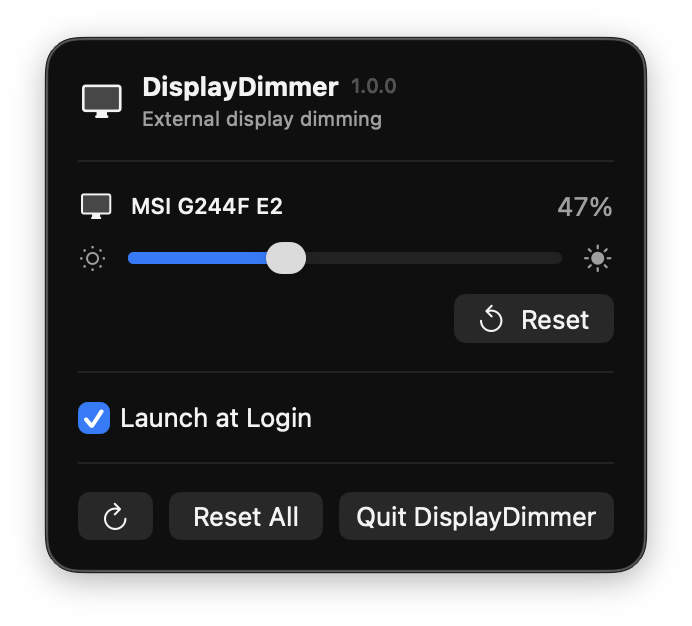

# DisplayDimmer

A lightweight macOS menu bar utility for dimming external displays beyond their comfortable minimum brightness.

  

## Download

Download the latest version from the [Releases](https://github.com/ulasyesilyurt/DisplayDimmer/releases) page.

## Features

- Detects connected external displays
- Software-based display dimming
- Per-display brightness control
- Remembers the preferred brightness level for each display
- Automatically reapplies dimming after wake or display reconnection
- Launch at Login support
- Reset individual displays or all displays at once
- Native macOS menu bar app built with Swift and SwiftUI

## Installation

1. Download `DisplayDimmer-v1.0.0.zip` from the [Releases](https://github.com/ulasyesilyurt/DisplayDimmer/releases) page.
2. Extract the archive.
3. Move `DisplayDimmer.app` to the Applications folder.
4. Open DisplayDimmer.

> DisplayDimmer is currently not notarized with an Apple Developer ID.  
> macOS may block the first launch. If that happens, go to **System Settings → Privacy & Security → Open Anyway**.

## Privacy & Security

DisplayDimmer is designed to be minimal and privacy-focused.

- No network access
- No analytics or telemetry
- No account required
- No file access
- No camera or microphone access
- Runs inside the macOS App Sandbox
- Hardened Runtime enabled
- No administrator privileges required

## How It Works

DisplayDimmer uses macOS display gamma tables to reduce the visible output of external displays.

This allows displays to appear darker than their normal minimum brightness setting.

> **Note:** DisplayDimmer performs software dimming. It does not reduce the monitor's physical backlight below its hardware minimum.

## Requirements

- macOS 13 or later
- At least one external display

## Compatibility

DisplayDimmer is built for macOS 13 and later.

Actual software dimming support may vary depending on Mac hardware, macOS version, and display configuration.

## Built With

- Swift
- SwiftUI
- AppKit
- CoreGraphics
- ServiceManagement

## License

DisplayDimmer is available under the [MIT License](LICENSE).
